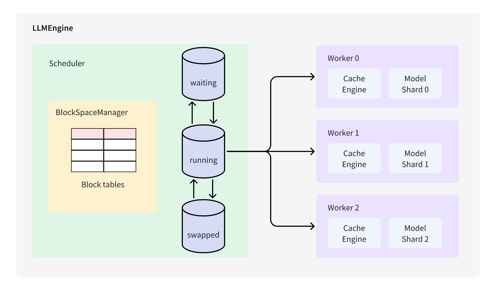

vLLM 是一个 LLM (Large Lanuage Model) 推理和部署服务库，结合 iterative-level schedule (常被称为 continuous batching，该调度算法在 Orca 中首次被提出) 和 PagedAttention 注意力算法以提高服务的吞吐量。

iterative-level schedule 以单轮迭代的方式对用户的请求进行处理，即 LLM 生成一个 token 后会重新调度下一轮要处理的请求。

PagedAttention 受操作系统虚拟内存和分页思想启发，将原本连续的 KV cache 存储在不连续的空间，以避免 KV cache 带来的显存浪费。

vLLM 的架构设计如下：

vLLM 的架构设计主要包含以下几个部分：

- 调度器（Scheduler）：负责管理用户的请求队列，并根据请求的优先级和模型参数的大小来决定请求的执行顺序; 管理块表的维护（BlockSpaceManger）。
    - 调度策略：
        - 请求队列（RequestQueue）：管理用户的请求队列，并根据请求的优先级和模型参数的大小来决定请求的执行顺序。
        - 块表（BlockTable）：管理块表的维护（BlockSpaceManger）。
    - 块表管理：
        - 块表（BlockTable）：管理块表的维护（BlockSpaceManger）。
    - 队列设计：
        - WaitQueue：等待队列，用于存储等待执行的请求。
        - RunningQueue：被调度的请求。
        - SwapQueue：用于存储被抢占的请求，当请求处于生成阶段的时候，由于空间不足，暂时从running队列中取出优先级低，等待空间释放后，重新调度。
- Worker 负责模型的推理执行；将大模型切分到多个Worker上共同完成请求的处理。